# Alternate Exchange Configuration

## 🔄 What is an Alternate Exchange?

An **alternate exchange** is a RabbitMQ feature that provides a fallback mechanism for messages that cannot be routed to any queue. It acts as a "safety net" to prevent message loss when routing keys don't match any queue bindings.

## 📊 Visual Flow Diagram

```mermaid
graph TD
    A["📤 Publisher<br/>routing_key: game.quest.INVALID"] --> B["🔄 game.skill Exchange<br/>(topic)"]
    
    B --> C{{"🔍 Routing Check"}}
    
    C -->|"✅ Match Found<br/>(game.quest.gather)"| D["📦 game.skill.gather.q"]
    C -->|"✅ Match Found<br/>(game.quest.slay)"| E["📦 game.skill.slay.q"]
    C -->|"❌ No Match<br/>(INVALID routing key)"| F["🔄 game.unroutable Exchange<br/>(fanout - alternate)"]
    
    F --> G["⚰️ game.dlq.unroutable.q<br/>(Unroutable DLQ)"]
    
    D --> H["👷 Worker processes message"]
    E --> I["👷 Worker processes message"]
    G --> J["📊 DLQ Management<br/>Visible in statusbar"]
```



## 🎯 How It Works

### Normal Message Flow
```
Publisher → Exchange → Queue (via routing key match) → Consumer
```

### Unroutable Message Flow (with Alternate Exchange)
```
Publisher → Exchange → No matching queue → Alternate Exchange → Unroutable DLQ
```

### Without Alternate Exchange
```
Publisher → Exchange → No matching queue → MESSAGE LOST! ❌
```

## 🏗️ Our Configuration

### Main Exchange (`game.skill`)
- **Type**: `topic`
- **Alternate Exchange**: `game.unroutable`
- **Valid Routing Keys**:
  - `game.quest.gather` → `game.skill.gather.q`
  - `game.quest.slay` → `game.skill.slay.q`

### Alternate Exchange (`game.unroutable`)
- **Type**: `fanout` (routes ALL messages to bound queues)
- **Destination**: `game.dlq.unroutable.q`
- **Purpose**: Capture messages with invalid routing keys

## 🧪 Testing Examples

### ✅ Routable Message
```bash
# This message will route successfully
curl -X POST -H "Content-Type: application/json" \
  -d '{"routing_key": "game.quest.gather", "payload": {"test": "routable"}}' \
  http://localhost:9000/api/publish
```
**Result**: Message goes to `game.skill.gather.q`

### ❌ Unroutable Message
```bash
# This message will go to alternate exchange
curl -X POST -H "Content-Type: application/json" \
  -d '{"routing_key": "game.quest.INVALID", "payload": {"test": "unroutable"}}' \
  http://localhost:9000/api/publish
```
**Result**: Message goes to `game.unroutable` → `game.dlq.unroutable.q`

## 🔧 Implementation Details

### API Server Configuration
In `api-server/internal/clients/rabbitmq.go`:
```go
// Declare alternate exchange for unroutable messages first
err = c.channel.ExchangeDeclare(
    "game.unroutable",
    "fanout",
    true,  // durable
    false, // auto-delete
    false, // internal
    false, // no-wait
    nil,   // arguments
)

// Declare the main exchange with alternate exchange for unroutable messages
err = c.channel.ExchangeDeclare(
    "game.skill",
    "topic",
    true,  // durable
    false, // auto-delete
    false, // internal
    false, // no-wait
    amqp.Table{
        "alternate-exchange": "game.unroutable",
    }, // arguments - route unroutable messages to alternate exchange
)
```

### Workers Configuration
In `workers/broker/client.go`:
```go
// Must declare with same arguments as API server
err = ch.ExchangeDeclare(
    ExchangeName, // "game.skill"
    ExchangeType, // "topic"
    true,         // durable
    false,        // auto-deleted
    false,        // internal
    false,        // no-wait
    amqp.Table{
        "alternate-exchange": "game.unroutable",
    }, // arguments - must match API server declaration
)
```

## 🚨 Important Considerations

### Exchange Argument Consistency
RabbitMQ requires **identical arguments** across all exchange declarations. If you declare an exchange with `alternate-exchange: "game.unroutable"`, ALL subsequent declarations must include the same argument.

**❌ This will fail:**
```go
// First declaration (API server)
amqp.Table{"alternate-exchange": "game.unroutable"}

// Second declaration (Workers) - DIFFERENT ARGUMENTS!
nil // This causes PRECONDITION_FAILED error
```

**✅ This works:**
```go
// Both declarations must be identical
amqp.Table{"alternate-exchange": "game.unroutable"}
```

### Setup Order
1. Create alternate exchange (`game.unroutable`)
2. Create unroutable DLQ queue (`game.dlq.unroutable.q`)
3. Bind unroutable queue to alternate exchange
4. Create/recreate main exchange with alternate-exchange argument
5. Rebind main queues to main exchange

## 📊 Monitoring Unroutable Messages

### Check DLQ Status
```bash
curl -s http://localhost:9000/api/dlq/list | jq '.data.categories.unroutable'
```

### View Messages in RabbitMQ Management
- **URL**: http://localhost:15672
- **Login**: guest/guest
- **Queue**: `game.dlq.unroutable.q`

### Frontend Monitoring
The enhanced DLQ statusbar shows unroutable message counts:
```
⚰️ DLQ: Failed:0 Unroutable:5 Expired:0 Retrying:0
```

## 🎓 Educational Value

The alternate exchange demonstrates important messaging concepts:

1. **Message Durability**: No message is lost, even with invalid routing
2. **Error Handling**: Systematic approach to handling routing failures
3. **Observability**: Clear visibility into what went wrong
4. **Debugging**: Easy identification of routing key mistakes

## 🔗 Related Documentation

- [RabbitMQ Alternate Exchanges](https://www.rabbitmq.com/ae.html)
- [DLQ Management](./README.md#dead-letter-queue-management)
- [Exchange Types](https://www.rabbitmq.com/tutorials/amqp-concepts.html#exchanges)